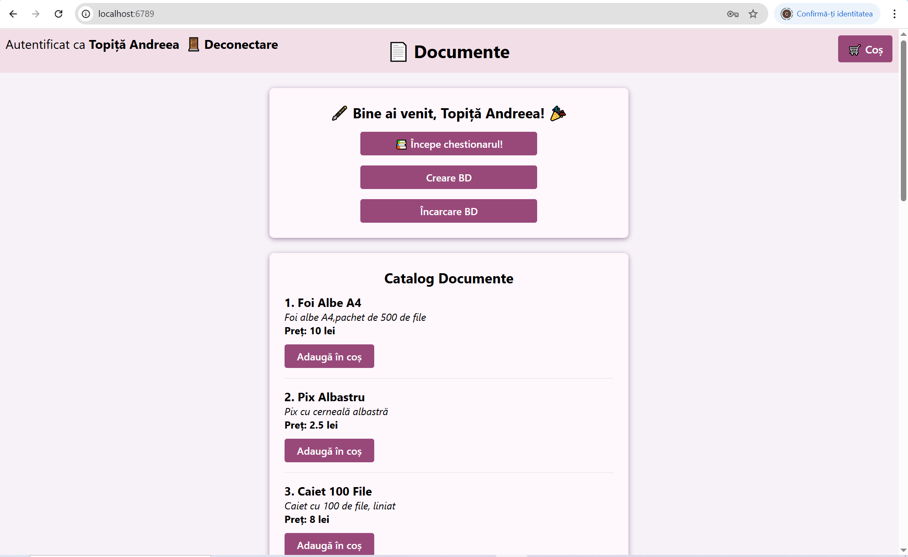
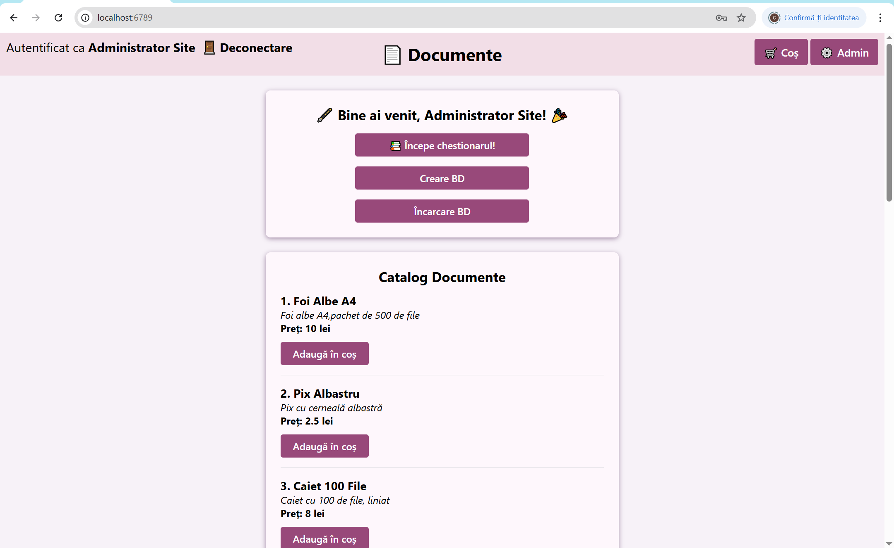
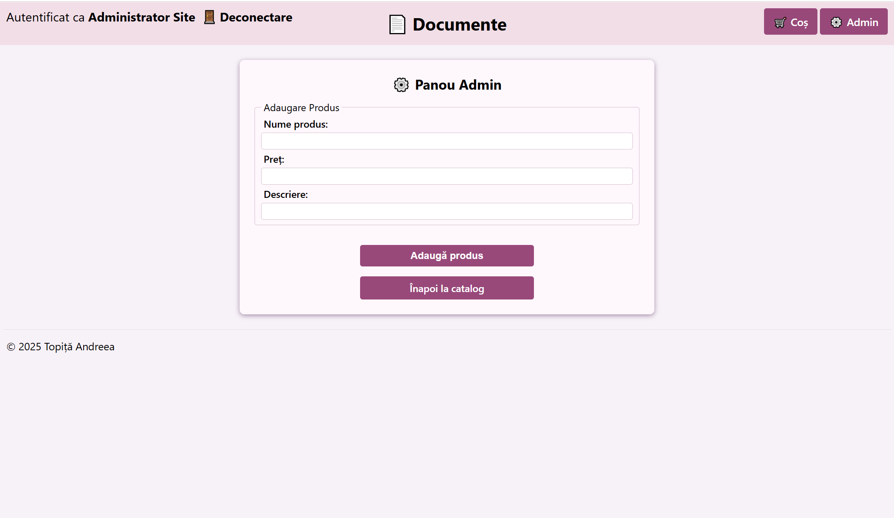

# 📚 Documents Web Project

A Node.js web application that features a dynamic document catalog with **role-based authentication** (USER/ADMIN).  
Users can browse documents and manage a shopping cart, while admins have access to an additional control panel to manage products.

## 🚀 Features

- Role-based login system (USER / ADMIN)
- Dynamic document catalog
- Admin dashboard for adding new documents (only accessible by admins)
- Shopping cart with session persistence
- Quiz section built with JSON data
- Data stored in a local SQLite database

## 🛠️ Technologies Used

- Node.js
- SQLite
- JavaScript
- HTML & CSS
- DB Browser for SQLite

### 👤 User View
When logged in as a regular user:

### 🛡️ Admin View
Admin sees extra options for catalog control:

### ⚙️ Admin Panel
Only admins can add new documents through the admin panel:

